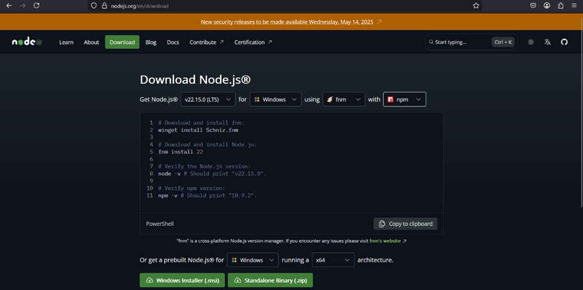

finalyearproject2025
# AI-Based Mobile Application for Waste Management and Recycling 
An organic waste management system that integrates AI to identify recyclable waste types and suggest recycling methods.

# Installation Guideline
React Native and Expo Setup 
Step 1: Install Node.js and npm
Navigate to the official website of Node.js to download the LTS (Long-Term Support) version of Node.js. Download the prebuilt architecture for Windows.

> 

A .msi file will be downloaded. After that, open the downloaded file and proceed with the installation steps. To verify the installation, check the version of Node.js and npm in the command prompt.

>   node -v
>   npm -v

