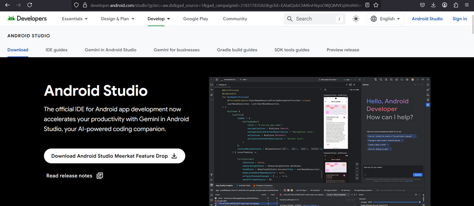
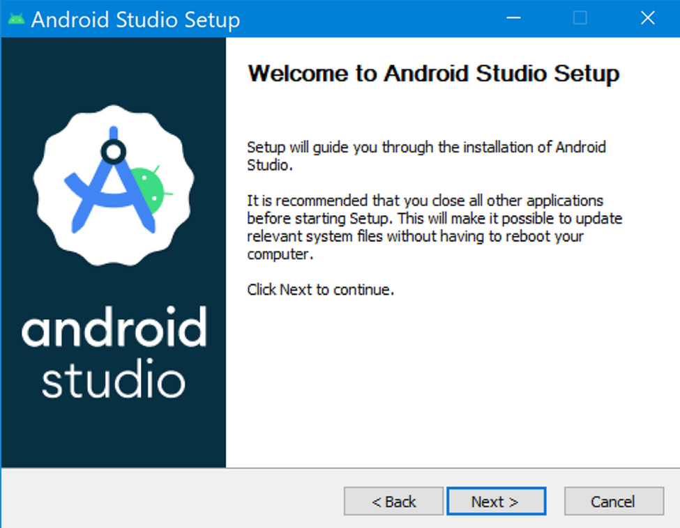
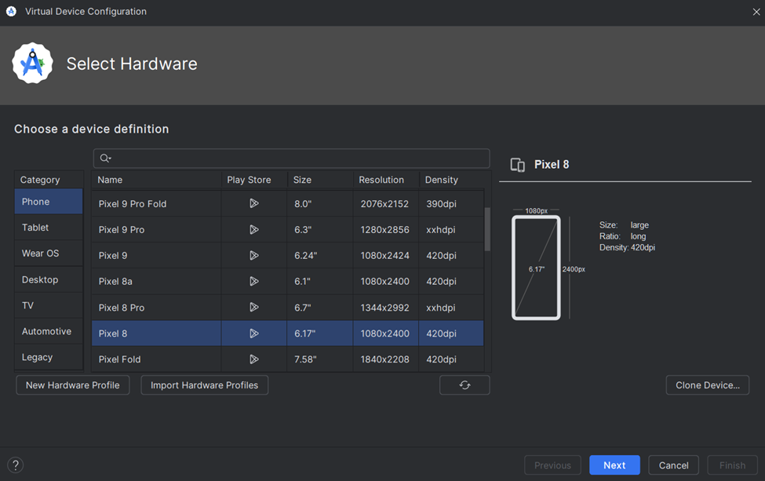

finalyearproject2025
# AI-Based Mobile Application for Waste Management and Recycling 
An organic waste management system that integrates AI to identify recyclable waste types and suggest recycling methods.

# Installation Guideline
React Native and Expo Setup 
Step 1: Install Node.js and npm
Navigate to the official website of Node.js to download the LTS (Long-Term Support) version of Node.js. Download the prebuilt architecture for Windows.

 

A .msi file will be downloaded. After that, open the downloaded file and proceed with the installation steps. To verify the installation, check the version of Node.js and npm in the command prompt.

       node -v
       npm -v

Step 2: Install Expo CLI
Run the command ‘npm install -g expo-cli’ to install Expo CLI globally.

Step 3: Install Android Studio
For Windows, navigate to Android Studio's official website and click on the ‘Download Android Studio’ button. A 64-bit version of Windows is required to install Android Studio.

Step 4: After Android Studio is downloaded, go to Tools > Device Manager > Create a Virtual Device.

Select ‘Pixel 8’ as a virtual device and click ‘Next.’  Select the system image as ‘VanillaIceCream’ of API level 35. If it's not downloaded, click the Download link next to it.

Step 5: Create a new Expo app
Run the command ‘npx create-expo-app@latest’ to create a new Expo project. Name the project as ‘MeroBhoomi’, then npm install will begin to run.

